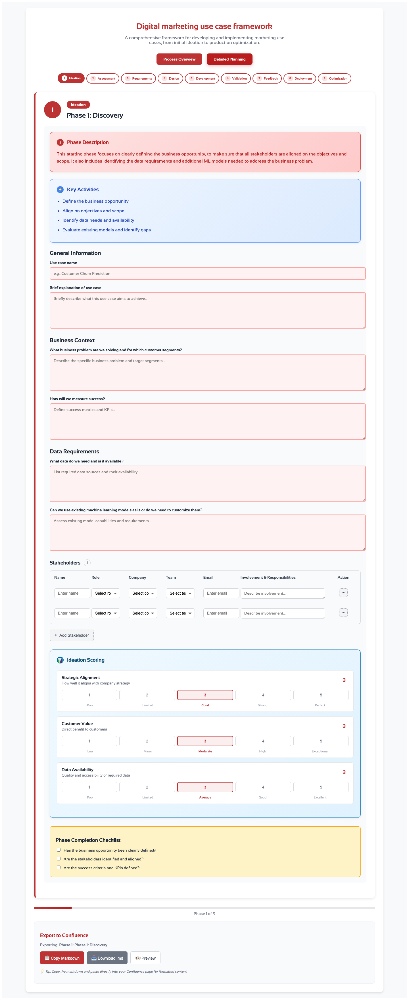

# Marketing Use Case Development Framework

A comprehensive interactive web application for developing and managing marketing use cases through a structured 9-phase framework. This tool guides teams from initial ideation through production optimization, with built-in documentation export for Confluence.


## 🎯 What This Project Does

This application provides a systematic approach to marketing use case development through nine structured phases:

1. **Ideation & Discovery** - Define business problems and success metrics
2. **Business Case Assessment** - Quantify ROI and get stakeholder approval  
3. **Requirements Gathering** - Define technical and functional requirements
4. **Technical Design & Planning** - Select approaches and design architecture
5. **Development & Testing** - Build and validate the solution
6. **Validation & Experimentation** - Run A/B tests and measure impact
7. **Process Feedback** - Process feedback and validate solution readiness
8. **Implementation & Deployment** - Deploy to production and monitor
9. **Optimization & Iteration** - Analyze performance and plan improvements

### Key Features

- **Interactive Forms**: Capture detailed information for each phase
- **Progress Tracking**: Visual checklists and progress indicators
- **Data Persistence**: All data stored locally in browser (no backend required)
- **Markdown Export**: Generate formatted documentation ready for Confluence
- **Modern UI**: Clean, responsive design with custom green theme
- **Self-Contained**: No database or server setup needed

## 📸 Screenshots

### Phase Detail View
Each phase includes detailed forms, checklists, and scoring mechanisms:



## 🚀 Quick Start

### Prerequisites

- [Bun](https://bun.sh/) (recommended) or Node.js 18+

### Installation & Development

```bash
# Clone the repository
git clone <repository-url>
cd vfde-marketing-use-case-framework

# Install dependencies
bun install

# Start development server
bun run dev
```

The application will be available at `http://localhost:5173`

### Production Build

```bash
# Build for production
bun run build

# Preview production build
bun run preview
```

## 📱 How to Use

1. **Choose Your View**: 
   - **Process Overview**: Visual timeline of all 9 phases
   - **Detailed Planning**: Work through individual phases step-by-step

2. **Fill Out Phase Details**: 
   - Complete forms with project-specific information
   - Check off items in the phase checklist as you progress

3. **Export Documentation**:
   - Use the "Export to Confluence" section at the bottom
   - Choose to export current phase or all phases
   - Copy markdown directly to clipboard or download as file
   - Paste into Confluence for formatted documentation

## 🛠️ Technology Stack

- **Frontend**: React 18 + TypeScript + Vite
- **Styling**: Tailwind CSS with custom theme
- **UI Components**: shadcn/ui component library
- **Package Manager**: Bun (fast JavaScript runtime)
- **Data Storage**: Browser localStorage (no backend needed)
- **Build Tool**: Vite for fast development and optimized builds

## 📁 Project Structure

```
├── src/
│   ├── components/        # React components
│   │   ├── phases/        # Phase-specific form components
│   │   └── ui/            # Reusable UI components
│   ├── hooks/             # Custom React hooks
│   ├── types/             # TypeScript type definitions
│   ├── data/              # Static configuration data
│   ├── utils/             # Utility functions (markdown generation)
│   └── App.tsx            # Main application component
├── public/                # Static assets
└── dist/                  # Production build output
```

## 🎨 Customization

### Adding New Phases

1. Update `src/data/phases.ts` with new phase information
2. Create a new component in `src/components/phases/`
3. Add the phase to the switch statement in `App.tsx`
4. Update the markdown generator to handle the new phase

### Styling

The application uses a custom green theme defined in `tailwind.config.js`. You can modify colors, spacing, and other design tokens there.

### Form Fields

All form fields use the reusable `FormField` component. Extend it or create new field types as needed for specific data collection requirements.

## 📋 Use Cases

This framework is ideal for:

- **Marketing Teams** planning data-driven campaigns
- **Product Owners** defining and tracking use cases
- **Project Managers** overseeing marketing initiatives
- **Data Analysts** documenting insights and optimizations
- **Data Engineers** structuring data pipelines for marketing projects
- **Data Scientists** implementing machine learning models for marketing
- **Business Analysts** analyzing and improving marketing processes
- **Consultants** providing structured frameworks to clients

## 🤝 Contributing

1. Fork the repository
2. Create a feature branch (`git checkout -b feature/amazing-feature`)
3. Commit your changes (`git commit -m 'Add amazing feature'`)
4. Push to the branch (`git push origin feature/amazing-feature`)
5. Open a Pull Request

## 📄 License

This project is licensed under the MIT License - see the LICENSE file for details.

## 🆘 Support

If you encounter any issues or have questions:

1. Check the existing issues in the repository
2. Create a new issue with a detailed description
3. Include steps to reproduce any bugs

---